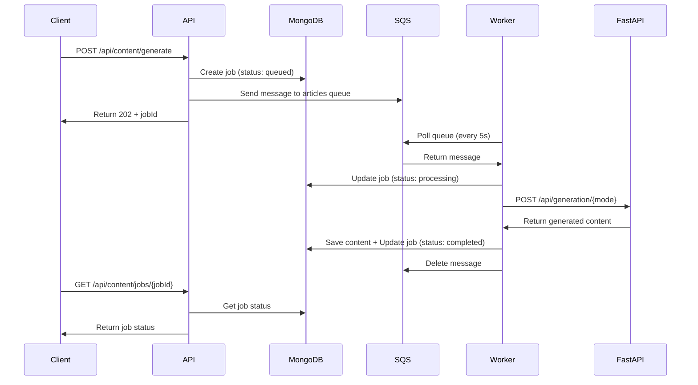
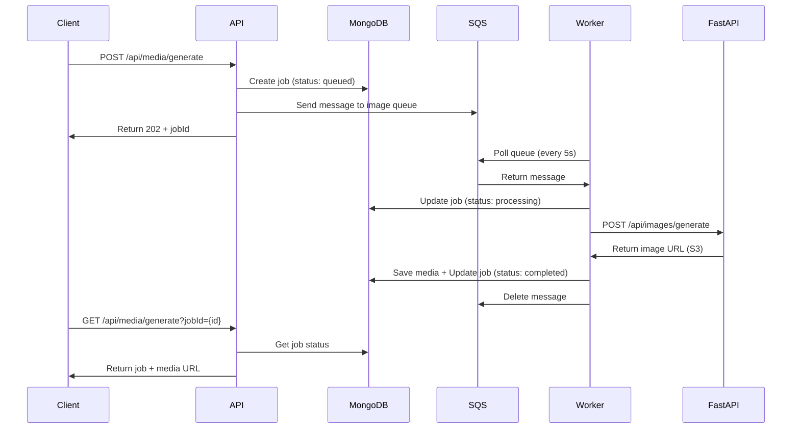

# SQS Queue Architecture - VIPContentAI

## 📋 Table of Contents

1. [Architecture Overview](#architecture-overview)
2. [System Components](#system-components)
3. [Message Flow](#message-flow)
4. [Queue Configuration](#queue-configuration)
5. [Worker Architecture](#worker-architecture)
6. [Error Handling & Retries](#error-handling--retries)
7. [Scaling & Performance](#scaling--performance)
8. [Monitoring & Observability](#monitoring--observability)
9. [Deployment Guide](#deployment-guide)

---

## 🏗️ Architecture Overview

The SQS queue architecture transforms VIPContentAI from a **synchronous request-response** model to an **asynchronous message queue** model. This decouples the API layer from the processing layer, providing better scalability, reliability, and user experience.

### High-Level Architecture

```
┌─────────────┐
│   Client    │
│  (Browser)  │
└──────┬──────┘
       │
       │ 1. POST /api/content/generate
       │    POST /api/media/generate
       ▼
┌─────────────────────────────────────┐
│      Next.js API Server             │
│  ┌───────────────────────────────┐ │
│  │  Route Handlers               │ │
│  │  - /api/content/generate      │ │
│  │  - /api/media/generate        │ │
│  └──────┬────────────────────────┘ │
│         │                            │
│         │ 2. Create Job (MongoDB)   │
│         │ 3. Send Message (SQS)     │
│         │ 4. Return 202 (immediate) │
└─────────┼────────────────────────────┘
          │
          ├─────────────────┬─────────────────┐
          │                 │                 │
          ▼                 ▼                 ▼
┌─────────────────┐ ┌─────────────────┐ ┌─────────────────┐
│     MongoDB     │ │   AWS SQS       │ │   FastAPI       │
│  (Job Status)   │ │  (Message Queue)│ │  (AI Service)    │
│                 │ │                 │ │                 │
│  - queued       │ │  - articles     │ │  - Content Gen  │
│  - processing   │ │  - images       │ │  - Image Gen    │
│  - completed    │ │  - videos       │ │                 │
│  - failed       │ │                 │ │                 │
└─────────────────┘ └────────┬────────┘ └─────────────────┘
                             │
                             │ 5. Worker polls queue
                             ▼
                    ┌─────────────────┐
                    │   SQS Worker    │
                    │  (Background)   │
                    │                 │
                    │  - Polls queues │
                    │  - Processes    │
                    │  - Updates DB   │
                    └────────┬────────┘
                             │
                             │ 6. Call FastAPI
                             ▼
                    ┌─────────────────┐
                    │   FastAPI       │
                    │  (AI Processing) │
                    └────────┬────────┘
                             │
                             │ 7. Save Results
                             ▼
                    ┌─────────────────┐
                    │     MongoDB     │
                    │  (Content/Media) │
                    └─────────────────┘
```

### Key Benefits

| Benefit | Description |
|---------|-------------|
| **Immediate Response** | API returns in < 1 second (HTTP 202) |
| **No Timeouts** | Long-running tasks handled by workers |
| **Automatic Retries** | Failed jobs retry via SQS visibility timeout |
| **Independent Scaling** | Scale API servers and workers separately |
| **Fault Tolerance** | Jobs persist in queue, survive crashes |
| **High Throughput** | Handle thousands of requests per minute |

---

## 🔧 System Components

### 1. SQS Service (`lib/services/sqs.ts`)

**Purpose:** Send messages to SQS queues

**Key Functions:**
- `queueArticleGeneration()` - Queue article jobs
- `queueImageGeneration()` - Queue image jobs
- `queueVideoGeneration()` - Queue video jobs (future)
- `isSQSConfigured()` - Check if SQS is available

**Message Structure:**
```typescript
{
  jobId: string;           // MongoDB job ID
  userId: string;          // User ID
  type: 'articles' | 'images' | 'videos';
  timestamp: string;       // ISO timestamp
  payload: {
    // Article or Image generation parameters
  }
}
```

### 2. SQS Worker (`lib/services/sqs-worker.ts`)

**Purpose:** Process messages from SQS queues

**Key Features:**
- Polls queues every 5 seconds (configurable)
- Processes up to 10 messages per poll (configurable)
- Uses long polling (20s wait) to reduce API calls
- Handles article and image generation
- Updates MongoDB job status
- Deletes messages after successful processing

**Configuration:**
```bash
SQS_POLL_INTERVAL=5000          # Poll every 5 seconds
SQS_MAX_MESSAGES=10             # Process 10 messages per poll
SQS_VISIBILITY_TIMEOUT=300      # 5 minutes visibility timeout
SQS_WAIT_TIME_SECONDS=20        # Long polling wait time
```

### 3. API Routes

#### Content Generation (`app/api/content/generate/route.ts`)

**Flow:**
1. Validate request
2. Create job in MongoDB (status: `queued`)
3. If SQS configured → Send message to SQS articles queue
4. If SQS not configured → Fallback to direct FastAPI call
5. Return HTTP 202 with `jobId`

#### Media Generation (`app/api/media/generate/route.ts`)

**Flow:**
1. Validate request
2. Create job in MongoDB (status: `queued`)
3. If SQS configured → Send message to SQS image queue
4. If SQS not configured → Fallback to direct FastAPI call
5. Return HTTP 202 with `jobId`

### 4. AWS SQS Queues

**Queue URLs:**
- **Articles:** `https://sqs.us-east-1.amazonaws.com/637423335500/prod-vipplay-articles`
- **Images:** `https://sqs.us-east-1.amazonaws.com/637423335500/prod-vipplay-image`
- **Videos:** `https://sqs.us-east-1.amazonaws.com/637423335500/prod-vipplay-video`

**Queue Features:**
- **Durability:** Messages persist even if worker crashes
- **Visibility Timeout:** Messages hidden for 5 minutes while processing
- **Dead Letter Queue:** Failed messages moved after max retries
- **FIFO (if configured):** Ensures message ordering

---

## 🔄 Message Flow

### Article Generation Flow



### Image Generation Flow



### Detailed Step-by-Step

#### Step 1: User Makes Request

```typescript
POST /api/content/generate
{
  "mode": "topic",
  "topic": "Fantasy Football Strategies",
  "wordCount": 1500,
  "tone": "Professional"
}
```

#### Step 2: API Creates Job & Queues Message

```typescript
// 1. Create job in MongoDB
const job = {
  userId: user.userId,
  status: 'queued',
  mode: 'topic',
  topic: 'Fantasy Football Strategies',
  // ... other fields
};
const jobId = await jobsCollection.insertOne(job);

// 2. Send to SQS queue
await queueArticleGeneration(jobId, userId, {
  mode: 'topic',
  topic: 'Fantasy Football Strategies',
  wordCount: 1500,
  tone: 'Professional',
  // ... other params
});

// 3. Return immediately
return NextResponse.json({
  success: true,
  jobId: jobId,
  message: 'Job queued successfully'
}, { status: 202 });
```

#### Step 3: SQS Stores Message

```json
{
  "jobId": "507f1f77bcf86cd799439011",
  "userId": "507f1f77bcf86cd799439012",
  "type": "articles",
  "timestamp": "2025-01-15T10:30:00Z",
  "payload": {
    "mode": "topic",
    "topic": "Fantasy Football Strategies",
    "wordCount": 1500,
    "tone": "Professional",
    "seoOptimization": true
  }
}
```

#### Step 4: Worker Polls & Processes

```typescript
// Worker polls queue every 5 seconds
const messages = await sqsClient.send(
  new ReceiveMessageCommand({
    QueueUrl: ARTICLES_QUEUE_URL,
    MaxNumberOfMessages: 10,
    WaitTimeSeconds: 20,      // Long polling
    VisibilityTimeout: 300,   // 5 minutes
  })
);

// Process each message
for (const message of messages.Messages) {
  await processMessage(message);
}
```

#### Step 5: Worker Calls FastAPI

```typescript
// Update job status
await jobsCollection.updateOne(
  { _id: jobId },
  { $set: { status: 'processing' } }
);

// Call FastAPI
const response = await fetch(`${FASTAPI_URL}/api/generation/topic`, {
  method: 'POST',
  body: JSON.stringify({
    topic: payload.topic,
    word_count: payload.wordCount,
    // ... other params
  })
});

const result = await response.json();
```

#### Step 6: Worker Saves Result

```typescript
// Save generated content
await generatedContentCollection.insertOne({
  userId,
  jobId,
  content: result.content,
  // ... other fields
});

// Update job status
await jobsCollection.updateOne(
  { _id: jobId },
  { $set: { status: 'completed', progress: 100 } }
);

// Delete message from queue
await sqsClient.send(
  new DeleteMessageCommand({
    QueueUrl: ARTICLES_QUEUE_URL,
    ReceiptHandle: message.ReceiptHandle
  })
);
```

---

## ⚙️ Queue Configuration

### Environment Variables

```bash
# AWS Configuration
AWS_REGION=us-east-1
AWS_ACCESS_KEY_ID=your-access-key-id
AWS_SECRET_ACCESS_KEY=your-secret-access-key

# SQS Queue URLs
SQS_ARTICLES_QUEUE_URL=https://sqs.us-east-1.amazonaws.com/637423335500/prod-vipplay-articles
SQS_IMAGE_QUEUE_URL=https://sqs.us-east-1.amazonaws.com/637423335500/prod-vipplay-image
SQS_VIDEO_QUEUE_URL=https://sqs.us-east-1.amazonaws.com/637423335500/prod-vipplay-video

# Worker Configuration
SQS_POLL_INTERVAL=5000              # Poll every 5 seconds
SQS_MAX_MESSAGES=10                 # Process 10 messages per poll
SQS_VISIBILITY_TIMEOUT=300          # 5 minutes visibility timeout
SQS_WAIT_TIME_SECONDS=20            # Long polling wait time
```

### Queue Attributes

**Recommended Settings:**

| Attribute | Value | Description |
|-----------|-------|-------------|
| **Visibility Timeout** | 300s (5 min) | Time message is hidden while processing |
| **Message Retention** | 14 days | How long messages are kept |
| **Receive Message Wait Time** | 20s | Long polling wait time |
| **Dead Letter Queue** | Enabled | Move failed messages after 3 retries |
| **Max Receive Count** | 3 | Number of retries before DLQ |

---

## 🔨 Worker Architecture

### Worker Process Flow

```
┌─────────────────────────────────────┐
│         Worker Startup              │
│  - Initialize SQS client            │
│  - Load configuration               │
│  - Validate queue URLs              │
└──────────────┬──────────────────────┘
               │
               ▼
┌─────────────────────────────────────┐
│      Main Polling Loop              │
│  (Runs every POLL_INTERVAL ms)      │
└──────────────┬──────────────────────┘
               │
       ┌───────┴───────┐
       │               │
       ▼               ▼
┌─────────────┐ ┌─────────────┐
│ Articles    │ │ Images      │
│ Queue Poll  │ │ Queue Poll  │
└──────┬──────┘ └──────┬──────┘
       │               │
       └───────┬───────┘
               │
               ▼
┌─────────────────────────────────────┐
│    Process Messages (Parallel)      │
│  - Parse message                    │
│  - Update job status                │
│  - Call FastAPI                     │
│  - Save results                     │
│  - Delete message                   │
└─────────────────────────────────────┘
```

### Worker Code Structure

```typescript
// Main worker loop
async function runWorker() {
  setInterval(async () => {
    // Poll articles queue
    if (ARTICLES_QUEUE_URL) {
      await pollQueue(ARTICLES_QUEUE_URL, 'articles');
    }
    
    // Poll images queue
    if (IMAGE_QUEUE_URL) {
      await pollQueue(IMAGE_QUEUE_URL, 'images');
    }
    
    // Poll videos queue
    if (VIDEO_QUEUE_URL) {
      await pollQueue(VIDEO_QUEUE_URL, 'videos');
    }
  }, POLL_INTERVAL);
}

// Poll queue function
async function pollQueue(queueUrl: string, queueName: string) {
  const messages = await sqsClient.send(
    new ReceiveMessageCommand({
      QueueUrl: queueUrl,
      MaxNumberOfMessages: MAX_MESSAGES,
      WaitTimeSeconds: WAIT_TIME_SECONDS,
      VisibilityTimeout: VISIBILITY_TIMEOUT,
    })
  );
  
  // Process messages in parallel
  await Promise.allSettled(
    messages.Messages.map(message => processMessage(message, queueUrl))
  );
}
```

### Worker Scaling

**Single Worker:**
- Processes messages sequentially per queue
- Good for low to medium load

**Multiple Workers:**
- Run multiple worker instances
- Each worker processes messages independently
- Scales horizontally

**Example:**
```bash
# Run 3 worker instances
pm2 start npm --name "sqs-worker-1" -- run worker:sqs
pm2 start npm --name "sqs-worker-2" -- run worker:sqs
pm2 start npm --name "sqs-worker-3" -- run worker:sqs
```

---

## 🛡️ Error Handling & Retries

### Error Scenarios

#### 1. FastAPI Service Unavailable

**Scenario:** FastAPI service is down or unreachable

**Handling:**
- Worker catches error
- Job status updated to `failed`
- Message NOT deleted from queue
- After visibility timeout (5 min), message becomes visible again
- Another worker picks it up and retries

**Flow:**
```
1. Worker receives message → hidden for 5 minutes
2. Worker calls FastAPI → fails
3. Worker updates job to 'failed'
4. Message NOT deleted
5. After 5 minutes → message visible again
6. Another worker picks it up → retries
```

#### 2. MongoDB Connection Error

**Scenario:** Cannot connect to MongoDB

**Handling:**
- Worker logs error
- Message NOT deleted
- Retries after visibility timeout

#### 3. Malformed Message

**Scenario:** Message body cannot be parsed

**Handling:**
- Worker logs error
- Message deleted immediately (prevents infinite retries)
- Job status remains `queued` (no update)

#### 4. Processing Timeout

**Scenario:** FastAPI takes longer than visibility timeout

**Handling:**
- Message becomes visible again
- Another worker may pick it up
- First worker completes and deletes message
- Second worker gets error (message already deleted)

**Solution:** Set visibility timeout longer than max processing time

### Retry Strategy

**Automatic Retries:**
- SQS visibility timeout provides automatic retries
- Failed messages become visible again after timeout
- Workers automatically retry processing

**Max Retries:**
- Configure Dead Letter Queue (DLQ) after N retries
- Move permanently failed messages to DLQ
- Manual review and reprocessing

**Retry Configuration:**
```bash
# Queue settings
Visibility Timeout: 300s (5 minutes)
Max Receive Count: 3
Dead Letter Queue: Enabled
```

---

## 📈 Scaling & Performance

### Performance Metrics

| Metric | Value | Notes |
|--------|-------|-------|
| **API Response Time** | < 1 second | Immediate return with jobId |
| **Worker Poll Interval** | 5 seconds | Configurable |
| **Messages per Poll** | 10 | Configurable |
| **Processing Time** | 2-10 minutes | Depends on content type |
| **Throughput** | 100+ jobs/min | With multiple workers |

### Scaling Strategies

#### 1. Horizontal Scaling (Workers)

**Add more worker instances:**
```bash
# Scale to 5 workers
for i in {1..5}; do
  pm2 start npm --name "sqs-worker-$i" -- run worker:sqs
done
```

**Benefits:**
- Process more messages in parallel
- Faster queue processing
- Better fault tolerance

#### 2. Vertical Scaling (Resources)

**Increase worker resources:**
- More CPU for parallel processing
- More memory for larger messages
- Faster network for FastAPI calls

#### 3. Queue Optimization

**Adjust polling parameters:**
```bash
# High throughput
SQS_POLL_INTERVAL=2000      # Poll every 2 seconds
SQS_MAX_MESSAGES=20         # Process 20 messages per poll

# Cost optimization
SQS_POLL_INTERVAL=10000     # Poll every 10 seconds
SQS_MAX_MESSAGES=5          # Process 5 messages per poll
```

### Load Testing

**Test Scenarios:**

1. **Low Load:** 10 jobs/minute
   - 1 worker sufficient
   - Queue depth: 0-5 messages

2. **Medium Load:** 100 jobs/minute
   - 2-3 workers recommended
   - Queue depth: 10-50 messages

3. **High Load:** 1000 jobs/minute
   - 10+ workers needed
   - Queue depth: 100-500 messages
   - Consider queue sharding

---

## 📊 Monitoring & Observability

### Key Metrics

#### Queue Metrics (AWS CloudWatch)

- **ApproximateNumberOfMessages:** Messages waiting in queue
- **ApproximateNumberOfMessagesNotVisible:** Messages being processed
- **NumberOfMessagesSent:** Total messages sent
- **NumberOfMessagesReceived:** Total messages received
- **NumberOfMessagesDeleted:** Total messages deleted

#### Application Metrics

- **Jobs Created:** Number of jobs created per minute
- **Jobs Completed:** Number of jobs completed per minute
- **Jobs Failed:** Number of failed jobs
- **Average Processing Time:** Time to process a job
- **Worker Uptime:** Worker process uptime

### Logging

**Worker Logs:**
```
[SQS Worker] Starting SQS worker...
[SQS Worker] Poll interval: 5000ms
[SQS Worker] Received 5 message(s) from articles queue
[SQS Worker] Processing article generation job 507f1f77bcf86cd799439011
[SQS Worker] Article generation job 507f1f77bcf86cd799439011 completed successfully
[SQS Worker] Message processed and deleted for job 507f1f77bcf86cd799439011
```

**Error Logs:**
```
[SQS Worker] Article generation job 507f1f77bcf86cd799439011 failed: FastAPI error: 503 Service Unavailable
[SQS Worker] Failed to process message for job 507f1f77bcf86cd799439011: Error message
```

### Monitoring Tools

1. **AWS CloudWatch:** Queue metrics and alarms
2. **Application Logs:** Worker and API logs
3. **MongoDB Metrics:** Job status tracking
4. **Custom Dashboards:** Grafana or similar

### Alerts

**Recommended Alerts:**

1. **High Queue Depth:** > 1000 messages
2. **Worker Down:** No worker activity for 5 minutes
3. **High Failure Rate:** > 10% jobs failing
4. **Slow Processing:** Average time > 15 minutes

---

## 🚀 Deployment Guide

### Development Setup

1. **Install Dependencies:**
```bash
npm install @aws-sdk/client-sqs
```

2. **Configure Environment:**
```bash
# .env.local
AWS_REGION=us-east-1
AWS_ACCESS_KEY_ID=your-key
AWS_SECRET_ACCESS_KEY=your-secret
SQS_ARTICLES_QUEUE_URL=https://sqs.us-east-1.amazonaws.com/637423335500/prod-vipplay-articles
SQS_IMAGE_QUEUE_URL=https://sqs.us-east-1.amazonaws.com/637423335500/prod-vipplay-image
```

3. **Start Worker:**
```bash
npm run worker:sqs
```

### Production Deployment

#### Option 1: PM2 Process Manager

```bash
# Install PM2
npm install -g pm2

# Start worker
pm2 start npm --name "sqs-worker" -- run worker:sqs

# Save PM2 configuration
pm2 save

# Setup PM2 startup script
pm2 startup
```

#### Option 2: Systemd Service

Create `/etc/systemd/system/sqs-worker.service`:

```ini
[Unit]
Description=SQS Worker for VIPContentAI
After=network.target mongodb.service

[Service]
Type=simple
User=www-data
WorkingDirectory=/var/www/vipplay-ai-content-generator
Environment=NODE_ENV=production
EnvironmentFile=/var/www/vipplay-ai-content-generator/.env.production
ExecStart=/usr/bin/npm run worker:sqs
Restart=always
RestartSec=10
StandardOutput=journal
StandardError=journal

[Install]
WantedBy=multi-user.target
```

Enable and start:
```bash
sudo systemctl enable sqs-worker
sudo systemctl start sqs-worker
sudo systemctl status sqs-worker
```

#### Option 3: Docker Compose

```yaml
services:
  sqs-worker:
    build: .
    command: npm run worker:sqs
    environment:
      - NODE_ENV=production
      - AWS_REGION=${AWS_REGION}
      - AWS_ACCESS_KEY_ID=${AWS_ACCESS_KEY_ID}
      - AWS_SECRET_ACCESS_KEY=${AWS_SECRET_ACCESS_KEY}
      - SQS_ARTICLES_QUEUE_URL=${SQS_ARTICLES_QUEUE_URL}
      - SQS_IMAGE_QUEUE_URL=${SQS_IMAGE_QUEUE_URL}
      - MONGODB_URI=${MONGODB_URI}
      - FASTAPI_URL=${FASTAPI_URL}
    restart: unless-stopped
    depends_on:
      - mongodb
```

### Scaling Workers

**Multiple Worker Instances:**

```bash
# Start 5 workers
for i in {1..5}; do
  pm2 start npm --name "sqs-worker-$i" -- run worker:sqs
done

# Monitor
pm2 list
pm2 logs sqs-worker
```

**Load Balancer Configuration:**

If using a load balancer, ensure workers are distributed across instances for high availability.

---

## 🔐 Security Considerations

### AWS Credentials

1. **Use IAM Roles:** Prefer IAM roles over access keys (EC2, ECS, Lambda)
2. **Rotate Credentials:** Regularly rotate AWS access keys
3. **Least Privilege:** Grant only necessary SQS permissions:
   - `sqs:SendMessage`
   - `sqs:ReceiveMessage`
   - `sqs:DeleteMessage`
   - `sqs:GetQueueAttributes`

### Message Security

1. **Encryption:** Enable SQS encryption at rest
2. **VPC Endpoints:** Use VPC endpoints for SQS access (if in VPC)
3. **Message Validation:** Validate message structure before processing

### Network Security

1. **Private Networks:** Run workers in private subnets
2. **Security Groups:** Restrict access to MongoDB and FastAPI
3. **TLS:** Use HTTPS for all API calls

---

## 📝 Best Practices

### 1. Visibility Timeout

Set visibility timeout longer than max processing time:
- Article generation: 300s (5 min) - typical 2-5 min
- Image generation: 180s (3 min) - typical 30-60s

### 2. Dead Letter Queue

Configure DLQ for failed messages:
- Max receive count: 3
- Move to DLQ after 3 retries
- Manual review and reprocessing

### 3. Idempotency

Ensure message processing is idempotent:
- Check job status before processing
- Use jobId to prevent duplicate processing

### 4. Monitoring

Monitor key metrics:
- Queue depth
- Processing time
- Failure rate
- Worker health

### 5. Error Handling

Handle errors gracefully:
- Log all errors
- Update job status
- Don't delete message on error (allows retry)

---

## 🔄 Migration Path

### Phase 1: Development
- ✅ Install SQS SDK
- ✅ Configure queues
- ✅ Test with single worker

### Phase 2: Staging
- ✅ Deploy worker to staging
- ✅ Test with production-like load
- ✅ Monitor metrics

### Phase 3: Production
- ✅ Deploy worker to production
- ✅ Monitor closely
- ✅ Scale as needed

### Phase 4: Optimization
- ✅ Tune polling parameters
- ✅ Optimize worker count
- ✅ Set up alerts

---

## 📚 Additional Resources

- **AWS SQS Documentation:** https://docs.aws.amazon.com/sqs/
- **SQS Setup Guide:** See `SQS_SETUP.md`
- **Architecture Explanation:** See `SQS_ARCHITECTURE_EXPLAINED.md`
- **Worker Code:** `lib/services/sqs-worker.ts`
- **Service Code:** `lib/services/sqs.ts`

---

## 🎯 Summary

The SQS queue architecture provides:

✅ **Scalability:** Handle high load with multiple workers  
✅ **Reliability:** Automatic retries and fault tolerance  
✅ **Performance:** Immediate API responses, no timeouts  
✅ **Flexibility:** Scale workers independently  
✅ **Observability:** Comprehensive logging and monitoring  

This architecture is production-ready and can handle thousands of content and image generation jobs per day.

